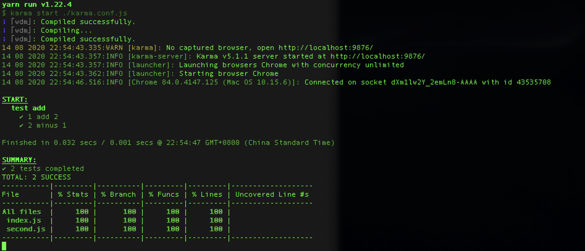
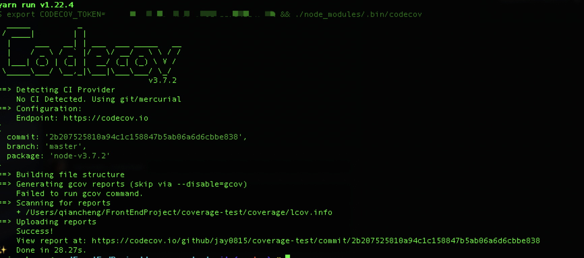

# coverage-test-demo-template
> A base test suit by karam

[](https://codecov.io/gh/jay0815/coverage-test)

[中文 README](./README-zh_CN.md)

### Features

* support __ES6__
  * has integrated __babel__
* support test in __(DOM|BOM)__
  * karam support headless browser and noarmal browser, so we can run code in real env
* support multi browsers
* support ___BDD___ or ___TDD___ test case
  * has integrated ___chai___
* suport ___coverage___ test
  * has integrated ___coverage-istanbul___
  * ``` yarn coverage ```

* suport check report in browser
  * has integrated ___webpack-dev-server___
  * ``` yarn report ```
* suport upload test result and get codecov
  * has integrated ___codecov___
  * ``` yarn codecov ```



### Who need this template

* want to write test case in ES6
* simulate formal environment
* has some little accidentes in put up karma test framework

_may be you can use AVA or Cypress or Jest_

### Choose the right reporter you want

[Istanbul's reporters](https://istanbul.js.org/docs/advanced/alternative-reporters/)

### How to use codecov
  * registered codecov
  * bind your repository in codecov
  * get CODECOV_TOKEN and replace same place into package.json
  * yarn codecov
  * go to codecov settings' Badge